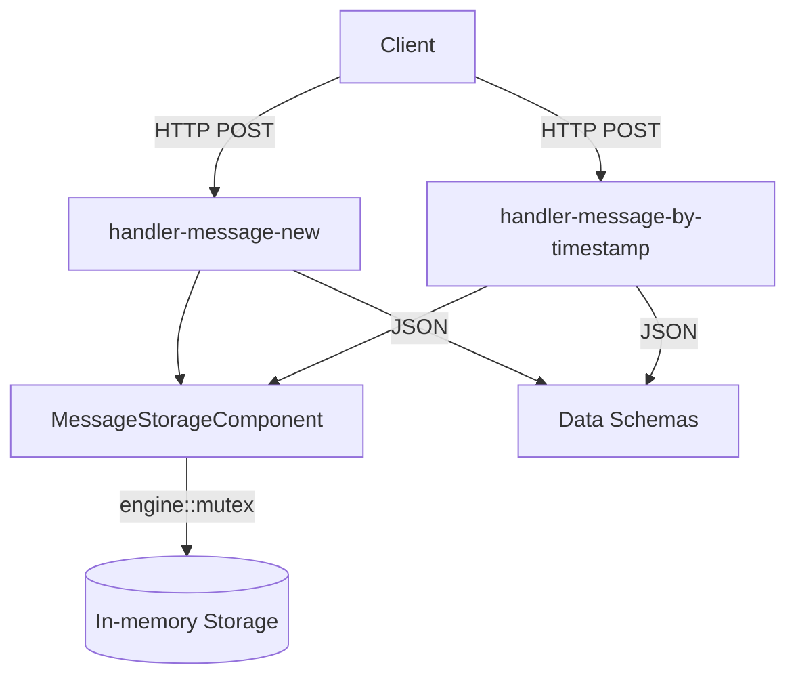

# Messaging Service Implementation Plan

## Overview
Implement two HTTP endpoints for the messaging service as specified in the OpenAPI documentation (`docs/messaging-service.yaml`). The service will use in-memory storage with thread-safe containers.

## Architecture

### Components Diagram


### File Structure
```
backend/messaging_service/
├── src/
│   ├── schemas.hpp                 # Data structures from OpenAPI spec
│   ├── message_storage_component.hpp
│   ├── message_storage_component.cpp
│   ├── message_new_handler.hpp
│   ├── message_new_handler.cpp
│   ├── message_by_timestamp_handler.hpp
│   ├── message_by_timestamp_handler.cpp
│   ├── main.cpp                    # Updated to register new components
│   └── ... (existing files)
├── configs/
│   └── static_config.yaml          # Updated with handler configurations
└── tests/
    └── test_messaging.py           # Functional tests
```

## Implementation Details

### 1. Data Schemas (`src/schemas.hpp`)
Based on OpenAPI specification, create the following C++ structures:

```cpp
// Channel ID (int64)
using V1ChannelId = int64_t;

// Message ID (int64)  
using V1MessageId = int64_t;

// Current user information
struct V1CurrentUser {
    std::string token;      // 128 characters
    std::string login;      // min 3 characters
    std::string name;       // human readable name
};

// Channel message structure
struct V1ChannelMessage {
    V1CurrentUser current_user;
    V1MessageId id;
    std::string timestamp;  // ISO8601 format
    std::string message;    // min 1 character
};

// Request/Response structures for both endpoints
struct V1ChannelMessageNewRequest { ... };
struct V1ChannelMessageNewResponse { ... };
struct V1ChannelMessageByTimestampRequest { ... };
struct V1ChannelMessageByTimestampResponse { ... };
struct V1Error { ... };
```

### 2. In-Memory Storage Component (`src/message_storage_component.hpp/.cpp`)
Thread-safe storage using `engine::mutex`:

```cpp
class MessageStorageComponent : public userver::components::ComponentBase {
public:
    static constexpr std::string_view kName = "message-storage";
    
    // Store a new message, return message ID
    V1MessageId StoreMessage(V1ChannelId channel_id, const V1ChannelMessage& message);
    
    // Retrieve messages by timestamp range with pagination
    std::vector<V1ChannelMessage> GetMessagesByTimestamp(
        V1ChannelId channel_id,
        const std::string& from,
        const std::optional<std::string>& to,
        size_t limit);
    
    // Check if channel exists (all IDs exist per spec)
    bool ChannelExists(V1ChannelId channel_id) const;
    
private:
    mutable userver::engine::Mutex mutex_;
    std::map<V1ChannelId, std::vector<V1ChannelMessage>> messages_by_channel_;
    std::atomic<V1MessageId> next_message_id_{1};
};
```

### 3. HTTP Handlers

#### 3.1 Message New Handler (`src/message_new_handler.hpp/.cpp`)
- **Endpoint**: `POST /v1/channel/message/new`
- **Functionality**: Creates new message in specified channel
- **Validation**:
  - Channel ID must be valid (all IDs exist per spec)
  - Message must not be empty
  - Current user must be provided
- **Response**: `{ "message_id": 12345 }`

#### 3.2 Message By Timestamp Handler (`src/message_by_timestamp_handler.hpp/.cpp`)
- **Endpoint**: `POST /v1/channel/message/by-timestamp`
- **Functionality**: Retrieves messages within timestamp range
- **Validation**:
  - Channel ID must be valid
  - `from` timestamp is required
  - `to` timestamp is optional (defaults to now)
  - `limit` must be 1-1000 (default 100)
- **Response**: `{ "messages": [...], "next_cursor": "...", "has_more": true/false }`
- **Pagination**: Simple timestamp-based pagination (no complex cursor)

### 4. Configuration Updates

#### `configs/static_config.yaml`
Add handler configurations:
```yaml
components:
    handler-message-new:
        path: /v1/channel/message/new
        method: POST
        task_processor: main-task-processor
    
    handler-message-by-timestamp:
        path: /v1/channel/message/by-timestamp
        method: POST
        task_processor: main-task-processor
    
    message-storage: {}
```

#### `src/main.cpp`
Update component registration:
```cpp
auto component_list =
    userver::components::MinimalServerComponentList()
        .Append<userver::server::handlers::Ping>()
        .Append<userver::components::TestsuiteSupport>()
        .AppendComponentList(userver::clients::http::ComponentList())
        .Append<userver::clients::dns::Component>()
        .Append<userver::server::handlers::TestsControl>()
        .Append<userver::congestion_control::Component>()
        .Append<messaging_service::Hello>()
        .Append<messaging_service::MessageStorageComponent>()
        .Append<messaging_service::MessageNewHandler>()
        .Append<messaging_service::MessageByTimestampHandler>();
```

#### `CMakeLists.txt`
Add new source files:
```cmake
add_library(
    ${PROJECT_NAME}_objs OBJECT
    src/greeting.cpp
    src/hello.cpp
    src/schemas.cpp
    src/message_storage_component.cpp
    src/message_new_handler.cpp
    src/message_by_timestamp_handler.cpp
)
```

### 5. Testing Strategy

#### Functional Tests (`tests/test_messaging.py`)
```python
async def test_message_new(service_client):
    response = await service_client.post(
        '/v1/channel/message/new',
        json={
            'current_user': {'token': '...', 'login': 'user1', 'name': 'User'},
            'channel_id': 1,
            'message': 'Hello world'
        }
    )
    assert response.status == 200
    assert 'message_id' in response.json()

async def test_message_by_timestamp(service_client):
    response = await service_client.post(
        '/v1/channel/message/by-timestamp',
        json={
            'channel_id': 1,
            'from': '2026-01-01T00:00:00Z',
            'limit': 10
        }
    )
    assert response.status == 200
    assert 'messages' in response.json()
```

## Implementation Sequence

1. **Create data schemas** (`schemas.hpp`) - Foundation for all components
2. **Implement storage component** - Core business logic with thread safety
3. **Create HTTP handlers** - REST API endpoints
4. **Update build configuration** - CMake integration
5. **Update service registration** - Component lifecycle
6. **Update static configuration** - Runtime settings
7. **Write functional tests** - API validation
8. **Build and test** - End-to-end verification

## Key Design Decisions

1. **In-memory storage**: As requested, all data stored in memory with `engine::mutex` for thread safety
2. **No authentication**: Current user accepted from request body without validation
3. **Simple pagination**: Timestamp-based pagination without complex cursor system
4. **Channel existence**: All channel IDs considered valid per specification
5. **Error handling**: Consistent error responses following OpenAPI spec
6. **JSON format**: All requests/responses use `application/json` content type

## Dependencies
- userver framework components
- Existing project structure patterns from auth_service
- OpenAPI specification as source of truth

## Success Criteria
- Both endpoints respond according to OpenAPI spec
- Thread-safe concurrent access to message storage
- Proper error handling for invalid requests
- Functional tests pass
- Service builds and runs without errors