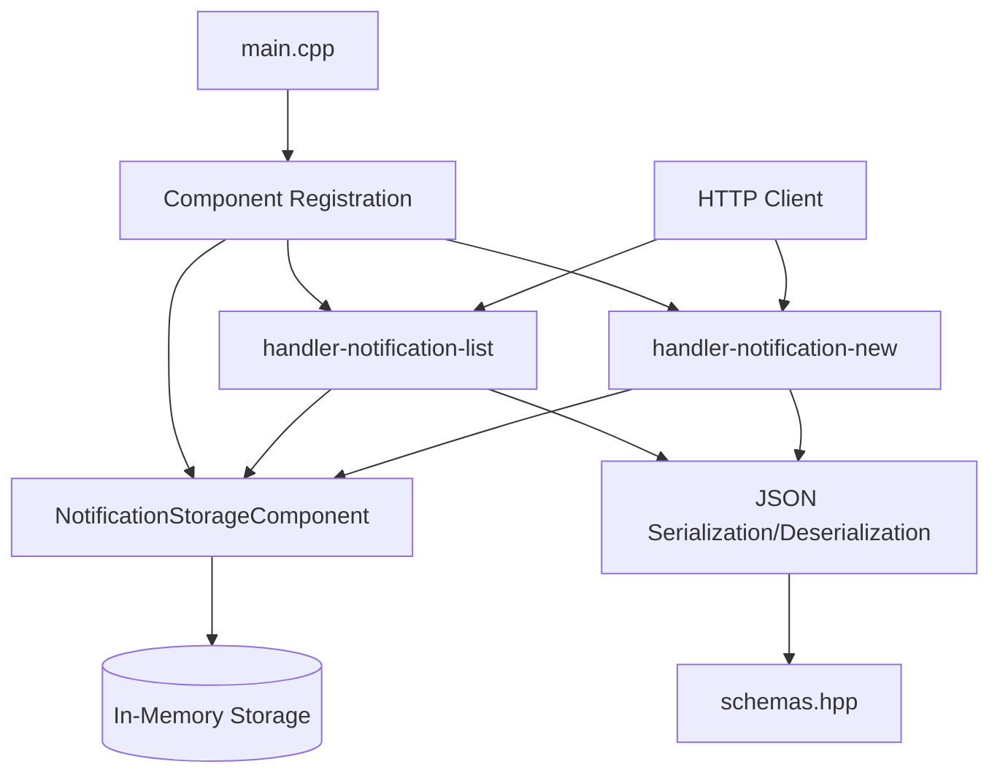

# Notifications Service Implementation Plan

## Overview
Implement the notifications service with two REST endpoints for channel-scoped notifications, using in-memory storage as requested.

## API Endpoints

### 1. POST `/v1/channel/notification/new`
- **Purpose**: Create a new notification for a user about a message in a channel
- **Request Body**: `V1ChannelNotificationNewRequest`
  - `current_user`: Object with token, login, name
  - `channel_id`: int64
  - `message_id`: int64  
  - `other_user_login`: string (login of user to notify)
- **Response**: `V1ChannelNotificationNewResponse`
  - `notification_id`: UUID string
- **Status Codes**: 200 (success), 400 (bad request), 500 (server error)

### 2. POST `/v1/channel/notification/list`
- **Purpose**: Get list of notifications for a user within a channel
- **Request Body**: `V1ChannelNotificationListRequest`
  - `current_user`: Object with token, login, name
  - `channel_id`: int64
- **Response**: `V1ChannelNotificationListResponse`
  - `notifications`: Array of `V1NotificationStatus` objects (message_id + read boolean)
- **Status Codes**: 200 (success), 400 (bad request), 500 (server error)

## Data Structures

### Core Types (schemas.hpp)
```cpp
using V1ChannelId = int64_t;
using V1MessageId = int64_t;
using V1Login = std::string;
using V1NotificationId = std::string; // UUID format

struct V1CurrentUser {
  std::string token;  // 128 chars, empty if not authorized
  std::string login;  // min 3 chars
  std::string name;   // human readable
};

struct V1NotificationStatus {
  V1MessageId message_id;
  bool read;
};

struct V1ChannelNotificationNewRequest {
  V1CurrentUser current_user;
  V1ChannelId channel_id;
  V1MessageId message_id;
  V1Login other_user_login;
};

struct V1ChannelNotificationNewResponse {
  V1NotificationId notification_id;
};

struct V1ChannelNotificationListRequest {
  V1CurrentUser current_user;
  V1ChannelId channel_id;
};

struct V1ChannelNotificationListResponse {
  std::vector<V1NotificationStatus> notifications;
};

struct V1Error {
  std::string error;
  int32_t code;
};
```

### In-Memory Storage Structure
```cpp
struct NotificationRecord {
  std::string notification_id;  // UUID
  V1ChannelId channel_id;
  V1MessageId message_id;
  V1Login target_user_login;    // User being notified
  V1Login sender_login;         // User who created notification
  bool read;
  std::chrono::system_clock::time_point created_at;
};

// Storage organization:
// Map<channel_id, Map<target_user_login, vector<NotificationRecord>>>
```

## Component Architecture



## Files to Create/Modify

### New Files
1. `src/schemas.hpp` - Data structures for requests/responses
2. `src/json_utils.hpp` / `json_utils.cpp` - JSON serialization/deserialization
3. `src/notification_storage_component.hpp` / `.cpp` - In-memory storage component
4. `src/notification_new_handler.hpp` / `.cpp` - Handler for creating notifications
5. `src/notification_list_handler.hpp` / `.cpp` - Handler for listing notifications

### Files to Modify
1. `src/main.cpp` - Register new components, remove Hello component
2. `configs/static_config.yaml` - Add handler configurations, remove handler-hello
3. `CMakeLists.txt` - Add new source files to build
4. Remove greeting/hello files (greeting.cpp, greeting.hpp, hello.cpp, hello.hpp, greeting_test.cpp, greeting_benchmark.cpp)

### Files to Remove
- `src/greeting.cpp`, `src/greeting.hpp`
- `src/hello.cpp`, `src/hello.hpp` 
- `src/greeting_test.cpp`, `src/greeting_benchmark.cpp`

## Implementation Details

### Notification Storage Component
- Inherits from `components::ComponentBase`
- Thread-safe in-memory storage using `engine::mutex`
- Methods:
  - `CreateNotification()`: Generate UUID, store record
  - `GetUserNotifications()`: Retrieve notifications for user in channel
  - `MarkAsRead()`: (Future) Mark notification as read

### JSON Utilities
- Parse functions for request structures
- Serialize functions for response structures
- Error handling for malformed JSON

### Handlers
- Validate required fields
- Return appropriate HTTP status codes
- Set `Content-Type: application/json`
- Log requests/responses at appropriate levels

### UUID Generation
- Use `boost::uuid` for UUID generation
- Convert to string format for JSON response

## Testing Strategy
1. **Unit Tests**: Test storage component logic
2. **Functional Tests**: Test HTTP endpoints via pytest_userver
3. **Edge Cases**: 
   - Duplicate notifications (same user, channel, message)
   - Non-existent user/channel (still stored since no validation)
   - Empty notification list

## Configuration Updates

### static_config.yaml
```yaml
handler-notification-new:
  path: /v1/channel/notification/new
  method: POST
  task_processor: main-task-processor

handler-notification-list:
  path: /v1/channel/notification/list
  method: POST
  task_processor: main-task-processor

notification-storage:  # In-memory storage component
```

### CMakeLists.txt
- Add new source files to `add_library` target
- Remove greeting/hello files from build

## Dependencies
- `boost::uuid` for UUID generation
- `userver::components` for component framework
- `userver::formats::json` for JSON handling

## Next Steps
1. Create schemas.hpp with data structures
2. Implement json_utils for serialization
3. Create notification storage component
4. Implement notification_new_handler
5. Implement notification_list_handler
6. Update main.cpp and configuration
7. Remove old greeting/hello handlers
8. Write basic tests