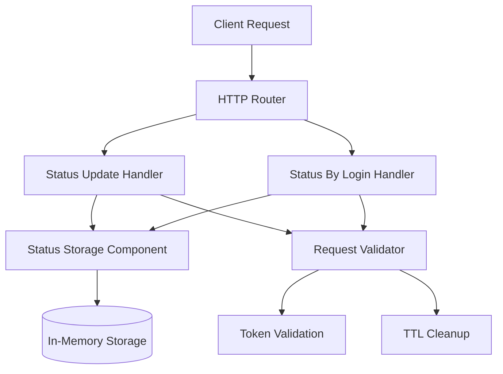

# Status Service Implementation Plan

## Overview
Implement a user status service with two endpoints according to the OpenAPI specification. All data will be stored in memory with TTL support and lazy cleanup.

## API Endpoints

### 1. POST `/v1/user/status/update`
- **Purpose**: Update the current user's status
- **Authentication**: Basic token validation (token must exist and not be empty)
- **Request Body**: `V1UserStatusUpdateRequest`
- **Response**: `V1UserStatusUpdateResponse`
- **Error Codes**: 400, 401, 500

### 2. POST `/v1/user/status/by-login`
- **Purpose**: Get another user's status by login
- **Authentication**: Basic token validation
- **Visibility Logic**: 
  - Public statuses: visible to anyone
  - Private statuses: only visible to the owner (returns 403 Forbidden)
- **Request Body**: `V1UserStatusByLoginRequest`
- **Response**: `V1UserStatusByLoginResponse`
- **Error Codes**: 400, 401, 403, 404, 500

## Data Structures (from OpenAPI)

### Core Types
- `V1Login`: string (min 3 chars)
- `V1StatusType`: enum [online, away, busy, offline]
- `V1Visibility`: enum [public, private]

### Main Structures
- `V1CurrentUser`: {token, login, name}
- `V1UserStatus`: {status_type, status_message, visibility}
- `V1UserStatusUpdateRequest`: {current_user, status}
- `V1UserStatusUpdateResponse`: {success, updated_at, expires_at}
- `V1UserStatusByLoginRequest`: {current_user, login}
- `V1UserStatusByLoginResponse`: {status}
- `V1ErrorResponse`: {error, message}

## Architecture

### Component Diagram


### Storage Design
- **In-memory map**: `std::unordered_map<V1Login, UserStatusRecord>`
- **UserStatusRecord**: Contains `V1UserStatus`, `updated_at`, `expires_at`
- **TTL Support**: Each status has optional expiration time
- **Lazy Cleanup**: On each storage operation, check and remove expired records
- **Thread Safety**: Use `engine::mutex` for concurrent access

### TTL Implementation
1. When storing a status, calculate `expires_at` if provided
2. Default TTL: 24 hours if not specified
3. Lazy cleanup: Before any read/write operation, scan and remove expired records
4. Optimization: Track oldest expiration for efficient cleanup

## File Structure

### New Files to Create
```
backend/status_service/src/
├── schemas.hpp                    # Data structures from OpenAPI
├── json_utils.hpp                 # JSON serialization/deserialization
├── json_utils.cpp
├── status_storage_component.hpp   # In-memory storage with TTL
├── status_storage_component.cpp
├── status_update_handler.hpp      # POST /v1/user/status/update
├── status_update_handler.cpp
├── status_by_login_handler.hpp    # POST /v1/user/status/by-login
└── status_by_login_handler.cpp
```

### Files to Remove
```
backend/status_service/src/
├── greeting.hpp
├── greeting.cpp
├── greeting_test.cpp
├── greeting_benchmark.cpp
├── hello.hpp
└── hello.cpp
```

## Implementation Steps

### 1. Create Data Structures (`schemas.hpp`)
- Define all structs from OpenAPI spec
- Include validation helpers (e.g., `IsValidStatusType`)

### 2. Create JSON Utilities (`json_utils.hpp/cpp`)
- Implement `Parse()` for all request structs
- Implement `Serialize()` for all response structs
- Follow userver patterns from other services

### 3. Create Storage Component (`status_storage_component.hpp/cpp`)
- Inherit from `components::ComponentBase`
- Thread-safe in-memory storage with `engine::mutex`
- TTL support with lazy cleanup
- Methods:
  - `StoreStatus(login, status, expires_at)`
  - `GetStatus(login) -> std::optional<UserStatusRecord>`
  - `CleanupExpired()` (private, called before operations)

### 4. Create Update Handler (`status_update_handler.hpp/cpp`)
- Inherit from `server::handlers::HttpHandlerBase`
- Validate token exists and not empty
- Parse request using `json_utils`
- Store status in storage component
- Return response with `success`, `updated_at`, `expires_at`

### 5. Create By-Login Handler (`status_by_login_handler.hpp/cpp`)
- Inherit from `server::handlers::HttpHandlerBase`
- Validate token exists and not empty
- Parse request using `json_utils`
- Check if target user exists
- Check visibility: if private and not owner, return 403
- Return status with `updated_at` field

### 6. Update `main.cpp`
- Remove `Hello` component registration
- Add new handlers and storage component
- Update component list

### 7. Update `CMakeLists.txt`
- Remove old source files (greeting.cpp, hello.cpp)
- Add new source files
- Update object library dependencies

### 8. Update `static_config.yaml`
- Remove `handler-hello` configuration
- Add configurations for new handlers:
  - `handler-status-update`
  - `handler-status-by-login`
- Set proper paths and methods

### 9. Create Functional Tests
- Test successful status update
- Test status retrieval (public/private)
- Test error cases (missing token, invalid data, etc.)
- Test TTL expiration

### 10. Clean Up Old Files
- Remove greeting and hello files
- Remove test files for old functionality

## Error Handling
- Follow OpenAPI `V1ErrorResponse` format exactly
- Use appropriate HTTP status codes
- Include descriptive error messages

## Testing Strategy
1. **Unit Tests**: Test storage component logic
2. **Functional Tests**: Test HTTP endpoints
3. **Integration Tests**: Test with other services

## Dependencies
- userver framework components
- JSON parsing/serialization
- Thread synchronization
- Time utilities for TTL

## Notes
- Token validation is basic (exists and not empty)
- TTL uses lazy cleanup to avoid background threads
- All responses follow OpenAPI spec exactly
- Storage is in-memory (will be lost on restart)